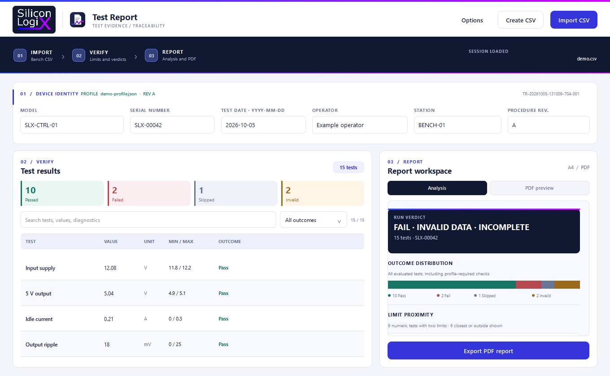
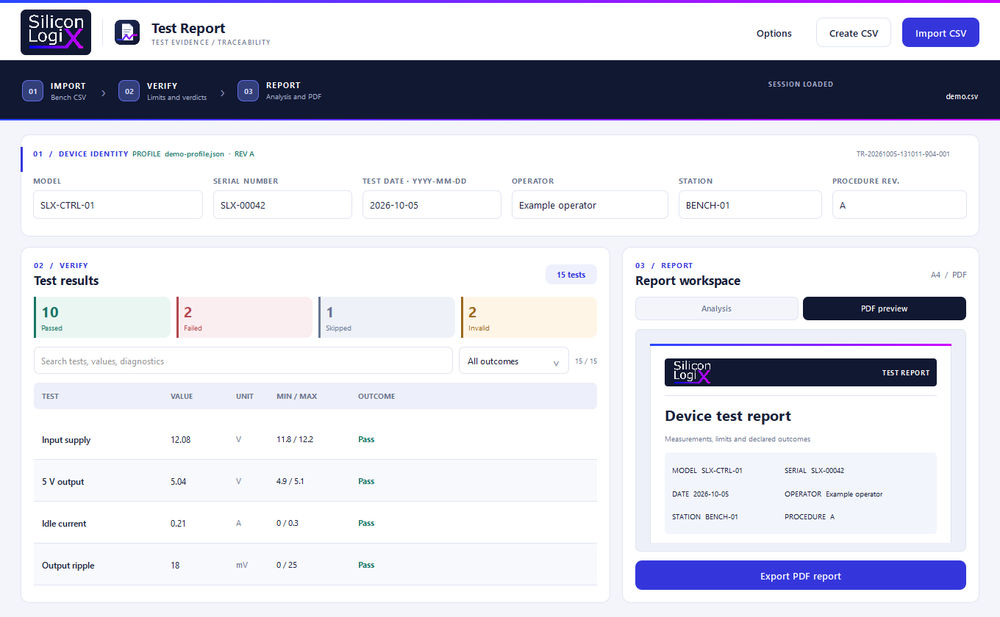

<!--
Silicon LogiX / SLX Test Report
Copyright (c) 2026 Marco Pezzullo (Silicon LogiX).
Author: Marco Pezzullo
License: Silicon LogiX Evaluation License 1.0. See LICENSE.
-->

# SLX Test Report

A desktop tool for turning bench CSV exports into verified, traceable PDF test reports. It runs without connecting to test instruments.

[](https://github.com/Silicon-Logix/slx-testreport/actions/workflows/ci.yml)



## Download and run

For Windows, download [SLX-Test-Report-win64.zip](https://github.com/Silicon-Logix/slx-testreport/releases/download/v0.5.2/SLX-Test-Report-win64.zip). Extract it, then open `SLX-Test-Report\slx-test-report.exe`. Keep the extracted folder intact: it contains the executable and its required runtime files.

To evaluate the workflow, choose **Options → Load single-device example**, inspect the results and analysis, then export a PDF. The example includes a missing required test so the report shows how incomplete evidence is handled. [View the sample CSV](examples/demo.csv) or [open its PDF report](examples/demo-report.pdf) without running the app.

## Build from source

Compilation requires a C++17 compiler, CMake 3.21+, Ninja for the Windows preset, and a Qt 6.2+ development kit with Quick, Quick Controls, Quick Dialogs and SVG. Qt Creator can configure the project with a compatible kit. On Windows with Qt's MinGW kit, set `QT_ROOT` to its root directory and add that kit's `bin` plus the matching MinGW `bin` to `PATH`, then run:

```powershell
$env:QT_ROOT = '<path-to-Qt-MinGW-kit>'
$env:PATH = "$env:QT_ROOT\bin;<path-to-matching-MinGW-bin>;$env:PATH"
cmake --preset windows-mingw
cmake --build --preset windows-mingw
ctest --preset windows-mingw --output-on-failure
```

The release preset was checked with Qt 6.12.0 and its matching MinGW compiler. For another platform or Qt kit, use CMake directly with the path to that kit:

```sh
cmake -S . -B build -DCMAKE_PREFIX_PATH=<path-to-Qt-kit> -DCMAKE_BUILD_TYPE=Release
cmake --build build
ctest --test-dir build --output-on-failure
```

The executable in the build directory needs Qt DLLs on `PATH` (Qt Creator sets this when it launches the app). To create a self-contained Windows bundle and zip from the MinGW build:

```powershell
.\scripts\package-windows.ps1 -BuildDirectory build\windows-mingw -CreateArchive
```

The package script reads Qt and compiler paths from the CMake cache and includes the application, runtime, examples and license notices. Debug metadata is removed from the packaged executable. It requires Qt 6.12.0 and the MinGW GCC 13.1.0 / MinGW-w64 v11 kit so its [source manifest](THIRD_PARTY_SOURCE.md) matches the DLLs. The source archives are separate assets on the same release page.

**Options → Load batch example** opens [two devices](examples/batch.csv) with a [batch profile](examples/batch-profile.json), including a CSV limit that disagrees with the profile. **Import CSV** opens a local file; you can also drop one CSV onto the window.

**Create CSV** opens a visual preparation sheet. Enter one test per row; **Add test** carries the previous serial forward, and different serials create a batch. **Open CSV** brings an existing file into the sheet for editing. The editor rejects files with extra columns it cannot preserve. **Save CSV and import** validates required fields, numeric syntax, status names and limit order, then writes UTF-8 CSV atomically and loads it into the report. An untouched trailing row is ignored. The editor quotes semicolons, quotation marks and multiline diagnostics automatically. It keeps the current sheet if an open or save fails.

[View the CSV editor](assets/screenshots/csv-editor.png).

## Investigate a run

The workflow follows **Import → Verify → Report**. The results table searches test names, values, units, limits and diagnostics. Outcome cards and the selector filter the table. Filtering never removes evidence from the PDF.

The **Analysis** view shows the distribution of all four outcomes and the six readings closest to or outside their limits. Each proximity rail positions a measurement between its own lower and upper limits, so tests with different units can be reviewed together. Tests with only one limit, functional checks, skipped rows and invalid rows remain in the table and PDF. The **PDF preview** shows the first 12 rows; the exported PDF contains every row.



When a CSV contains several serial numbers, use the selector above the device fields to inspect each unit. **Export selected** saves its PDF; **Export all PDFs** creates a new folder with one report per device. The complete batch is staged in a temporary folder and published together when every PDF succeeds. Rows with no serial go into an **UNASSIGNED** report and remain invalid.

## CSV contract

The first row is a header. Column order may vary. `serial` and `test` are required, along with at least one of `value` or `status`. Other columns are optional:

| Column | Meaning |
| --- | --- |
| `serial` | Device serial number. Several devices may share one CSV; each gets its own report. |
| `test` | Test or check name. |
| `value` | Numeric measurement when limits are present. |
| `unit` | Unit label; may be blank for dimensionless readings. |
| `min`, `max` | Inclusive numeric limits; either one may be blank. |
| `status` | Optional declared `PASS`, `FAIL`, `SKIPPED`/`NOT_RUN`/`N/A` or `ERROR`/`ABORTED`/`INCONCLUSIVE`. |
| `diagnostic` | Optional bench message retained with the row. |

For example:

```csv
serial;test;value;unit;min;max;status;diagnostic
UNIT-7;Supply voltage;5.01;V;4.90;5.10;;
UNIT-7;Barcode scan;;;;;PASS;Scanner matched
UNIT-7;Firmware programming;;;;;SKIPPED;Image unavailable
```

Semicolon or comma separators, UTF-8 with or without a BOM, quoted fields, and decimal commas or points are accepted. With a comma separator, quote values that use a decimal comma. Italian column aliases from earlier versions remain accepted for existing bench exports.

Valid numbers retain their source precision in the CSV and are displayed with a consistent decimal point in the application and PDF. The source file is never rewritten during import; its SHA-256 digest identifies the original bytes.

Without a test profile, numeric tests are judged against the limits in the CSV. If a declared PASS/FAIL disagrees with the measurement, the row becomes **Invalid data** and the conflict is shown. A row without limits requires a declared PASS/FAIL to count as a functional check. SKIPPED/NOT_RUN marks a test as incomplete, and ERROR marks its data invalid. Missing or malformed measurements, unsupported statuses, inconsistent limits and malformed records stay visible as invalid rows. A missing required header rejects the import and preserves the previously loaded run.

## Versioned test profile

Use **Options → Load test profile** to import a JSON file with `schemaVersion: 1`, a model, a revision and test definitions. A numeric test has an optional unit and at least one numeric `min` or `max`. A functional test uses a declared status. Tests are required by default; set `"required": false` for an optional check:

```json
{
  "schemaVersion": 1,
  "model": "UNIT-7",
  "revision": "B",
  "tests": [
    { "name": "Supply voltage", "kind": "numeric", "unit": "V", "min": 4.9, "max": 5.1 },
    { "name": "Barcode scan", "kind": "functional" },
    { "name": "Optional LED", "kind": "functional", "required": false }
  ]
}
```

Profile limits become the acceptance criteria even if the CSV contains no limits. Any limits supplied by the CSV are compared with the profile, so disagreements, wrong units and unsupported tests appear as **Invalid data**. Repeated test names are marked invalid; missing required tests are added as explicit invalid rows for each device. The model and revision are read from the profile and locked while it is active. A malformed profile is rejected without replacing the current one. **Clear test profile** returns to CSV-based evaluation.

## Report and traceability

Enter model, test date (`YYYY-MM-DD`), operator, station and procedure revision before export; model and revision come from the profile when one is loaded. The serial comes from the CSV. Every device receives a distinct report ID. The A4 PDF includes the import timestamp, SHA-256 digest of the exact CSV bytes, and the profile name and SHA-256 digest when used, along with outcome graphic, measurements, limits, verdicts and diagnostics. It paginates as needed.

The overall verdict is **PASS** only when all tests pass. Failed tests produce **FAIL**; invalid rows add **INVALID DATA** or require review; skipped tests add **INCOMPLETE**. The PDF filename defaults to a serial and report ID next to the source CSV, but you may choose another location. Output is committed atomically after successful generation. An evidence appendix preserves full test names and diagnostics when the compact table elides them.

Importing another CSV keeps a manually loaded profile active, but clears the model and procedure revision when no profile is active. Operator and station remain available for repeated work at the same bench. Importing a real file after a bundled example clears that example's profile, operator and station.

## Project map

| Area | Responsibility |
| --- | --- |
| `src/reportdata.*` | Parse CSV and classify numeric, functional and incomplete tests. |
| `src/csvcomposer.*`, `qml/CsvComposerDialog.qml` | Edit, validate and atomically save bench CSV files. |
| `src/profiledata.*` | Validate versioned JSON profiles and compare every device with expected tests. |
| `src/resultsmodel.*` | Expose results to QML. |
| `src/resultsfiltermodel.*` | Search and filter without changing source evidence. |
| `src/reportcontroller.*` | Group devices, manage profiles and metadata, and export one or all reports. |
| `src/pdfexport.*` | Lay out and atomically save a paginated A4 PDF. |
| `qml/Main.qml` | Connect actions and file dialogs to the views. |
| `qml/AnalysisView.qml` | Render outcome distribution and per-test limit proximity. |
| `qml/*Panel.qml`, `qml/ReportPreview.qml` | Keep inputs, results and report presentation separate. |
| `assets/brand/` | Hold the supplied Silicon LogiX wordmark and the product icon. |
| `tests/` | Verify CSV preparation, parsing, filtering, QML startup and CSV-to-PDF workflow. |

If you edit the SVG app icon, rebuild its Windows ICO before compiling:

```powershell
cmake --build --preset windows-mingw --target slx-icon-maker
.\build\windows-mingw\slx-icon-maker.exe .\assets\brand\report-icon.svg .\assets\brand\report-icon.ico
cmake --build --preset windows-mingw
```

## Author and license

Copyright and authorship: **Marco Pezzullo (Silicon LogiX)**. The [Silicon LogiX Evaluation License 1.0](LICENSE) permits study, evaluation and private modifications. Only intact, attributed copies may be shared. Commercial use and distribution of modified versions require written permission. This is a source-available license, not an open-source license.

Qt and other components retain their own terms; see [third-party notices](THIRD_PARTY_NOTICES.md) and the [runtime source archives](THIRD_PARTY_SOURCE.md) supplied beside the Windows bundle. The Qt DLLs remain replaceable. [Qt explains its LGPL obligations](https://www.qt.io/development/open-source-lgpl-obligations).
